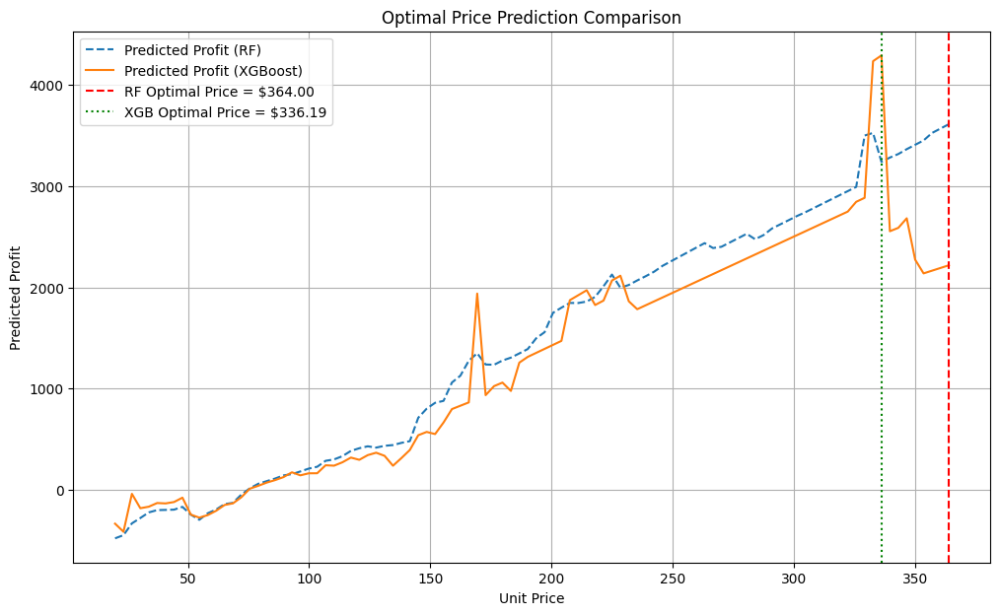

# 📈 Pricing Model from Scratch

This project builds an **end-to-end Pricing Optimization Model** using real retail transaction data. It predicts **quantity sold** based on price and other factors, simulates **optimal selling prices** to maximize profit, and compares models like **Random Forest** and **XGBoost**.

---

## 📚 Project Structure

| Step | Description |
|:----:|:------------|
| 1 | **Data Loading & Cleaning** — Load `retail_price.csv`, handle missing values |
| 2 | **Exploratory Data Analysis (EDA)** — Distribution plots, scatter plots, correlation matrix, and boxplots |
| 3 | **Feature Engineering** — Create `Revenue`, `Profit`, `Profit %`, and `Cost %` columns |
| 4 | **Predictive Modeling** — Train and evaluate Random Forest and XGBoost models |
| 5 | **Hyperparameter Tuning** — Optimize Random Forest with GridSearchCV |
| 6 | **Feature Importance Analysis** — Identify key drivers of quantity sold |
| 7 | **Optimal Price Simulation** — Find prices that maximize profit using model predictions |
| 8 | **Comparison** — Visualize Random Forest vs XGBoost optimal price strategies |

---

## 🛠 Technologies Used

- **Python 3.11**
- **Pandas** — Data manipulation
- **Seaborn / Matplotlib** — Visualization
- **Scikit-learn** — Modeling and evaluation
- **XGBoost** — Advanced modeling
- **GridSearchCV** — Hyperparameter tuning

---

## ⚡ Highlights

- Achieved **38% R²** with Random Forest and XGBoost.
- Tuned Random Forest using **GridSearchCV** for best parameters.
- **Feature importance** showed `freight_price` and `unit_price` as strongest predictors.
- Predicted **optimal prices** using both Random Forest and XGBoost models.
- **Profit maximization plots** for strategic pricing decisions.

---

## 📊 Key Visualizations

- Unit Price Distribution
- Quantity Sold vs Unit Price
- Feature Importances
- Revenue and Profit Curves
- Optimal Price Comparison: Random Forest vs XGBoost

---

## ✨ Results: Optimal Price Comparison

The plot below compares the predicted profit curves for the Random Forest (RF) and XGBoost models across a range of unit prices. The vertical lines indicate the optimal price point identified by each model to maximize predicted profit.


---

## 🚀 Future Work

- Integrate more features (e.g., customer demographics, seasonality effects)
- Apply **cross-validation** for robust evaluation
- Explore **advanced explainability** with SHAP values
- Deploy as an **interactive pricing dashboard** (using Streamlit or Dash)

---

## 📂 How to Run

1. Clone this repository
2. Install dependencies:
   ```bash
   pip install pandas matplotlib seaborn scikit-learn xgboost
   ```
3. Run the notebook in Jupyter or VSCode.

---


